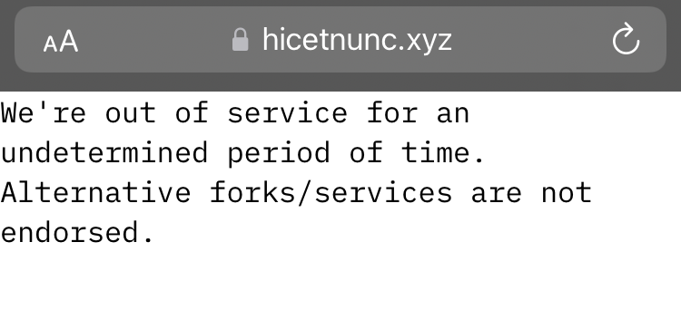

# HEN timeline

*Please make sure to read the [README.md](README.md) for context and license use*

*If you read this on Github, there is a more comfortable reading experience on Gitbook: [https://crcdng.gitbook.io/hen-tl/](https://crcdng.gitbook.io/hen-tl/)*

## Introduction

[Hic et Nunc](https://web.archive.org/web/20211107123525/https://www.hicetnunc.xyz/) (abbreviated H=N, HEN or hen) was the first NFT art place on the [Tezos](https://tezos.com/) blockchain. This brief timeline is meant to help preserve common memory by recording key events of its development. Therefore it primarily focuses on Hic et Nunc itself (and later on the offsprings coming out of the community such as Teia) and does not attempt to serve as a timeline of blockchains, NFTs or crypto art in general. These topics are already covered in some excellent resources:

* [https://decal.furtherfield.org/2020/05/22/a-blockchain-art-history-timeline/](https://decal.furtherfield.org/2020/05/22/a-blockchain-art-history-timeline/) by Furtherfield
* [https://mlo.art/research/history-of-crypto-art/](https://mlo.art/research/history-of-crypto-art/) by Martin Lukas Ostachowski
* [https://nfttimeline.com/](https://nfttimeline.com/) 

A comprehensive collection complementing this timeline is ["The Museum of Tezos Artfkts"](https://artfkt.art/), also at [https://teia.art/the_museum_of_tezos_artfkts](https://teia.art/the_museum_of_tezos_artfkts). 

It will be up to everyone individually to make sense of a phenomenon that, for most people, was operating since March 1, 2021 and reached 100.000 minted NFTs three months and 500.000 eight months later. Beyond the numbers, the events listed below might provide some clues to its unique development: a set of experiments in various directions, an exploding crypto art and energy consumption debate, Twitter as a nervous system and amplifier, a frictionless “open for all“ art platform, an eco-friendly Proof-of-Stake blockchain, and an emerging and diverse community that includes artists, collectors, curators and hackers. 

However, [this tweet](https://twitter.com/mattmedved/status/1385760755958562816) by Matt Medved captures another aspect of H=N that goes beyond rational analysis and historical explanation. Around the same time in April, I [wrote](https://twitter.com/crcdng/status/1386658359290613760) “it feels a bit like the place you visit together after the grand gallery opening to have fun and explore” and shared my [impressions](https://twitter.com/crcdng/status/1386730188654977031) during the second OBJKT4OBJKT weekend: “a new community of artists and curators is emerging, an art system within the art system”.

This timeline is dedicated to that community.

## A Brief Timeline of Hic et Nunc, Teia, and beyond

### September 17, 2018
Launch of the public [Tezos blockchain](https://tezos.com/), the “mainnet”.

### March 1, 2020
The first tweet from Twitter account [@hicetnunc2000](https://twitter.com/hicetnunc2000) contains a [link](https://www.youtube.com/watch?v=u3aE3Z6llMc) to the lecture "A Thousand Years of Nonlinear History" by philosopher Manuel De Landa. *This tweet has been deleted in the meantime, see note at the end.*

### May 19, 2020
“rearranging architectures, terraforming autonomous communities […] hicetnunc2000 is a lab for decentralized computing experiments” ([Medium article](https://hicetnunc2000.medium.com/ungrund-e4ac3e30de9e))

### July 7, 2020
Rafael Lima [wins the Tezos + CoinList Hackathon](https://blog.coinlist.co/announcing-the-winners-of-the-tezos-coinlist-hackathon/) with the project "[Ungrund Oracle - open source infrastructure to connect microsservices to the tezos network](https://coinlist.co/build/tezos/projects/29cc917b-a0ad-4c99-8679-65368db00eca)".

“Hicetnunc by Rafael Lima, geared towards crowdfunding and crowdsourcing in the e-sports community, receives a grant by the Tezos foundation” ([Announcement](https://tezos.foundation/fourth-cohort-grants/)).

### August 20, 2020
“coming live” ([deleted Tweet](https://twitter.com/hicetnunc2000/status/1296554519933997058))

### September 3, 2020
The [“Delphi” upgrade to the Tezos blockchain](https://blog.nomadic-labs.com/delphi-official-release.html) significantly reduces transaction costs, which makes microtransactions on Tezos even more feasible than before. 

### September 23, 2020
“Friends, something has been bugging me for a while. The world is burning”, begins the [tweet](https://twitter.com/memotv/status/1308683955705655296) in which artist Memo Akten addresses deep concerns about the energy usage of crypto art. In the subsequent days and weeks heated debates ensue. Memo subsequently [publishes essays](https://memoakten.medium.com/the-unreasonable-ecological-cost-of-cryptoart-2221d3eb2053) and [research](https://github.com/memo/eco-nft), including a tool to calculate the energy consumption of NFT artworks. The tool was weaponized against individual artists which was not in the intention of its creator and [therefore was withdrawn later](http://cryptoart.wtf).  

### September 27, 2020
Rafael Lima [develops random-bridge](https://www.youtube.com/watch?v=jKihf2JpqiA) during a chainlink hackathon.

### October 8, 2020
“A microservice to upload files into IPFS” ([deleted Tweet](https://twitter.com/hicetnunc2000/status/1314084398124367872)).
 
### October 17, 2020
Milestone reached: “microfunding protocol is live” ([deleted Tweet](https://twitter.com/hicetnunc2000/status/1317308306189332481)).

### October 27, 2020
”hicetnunc microfunding protocol” ([Medium article](https://hicetnunc2000.medium.com/hicetnunc-microfunding-protocol-e270a63eb73c)).
 
### November 7, 2020
hicetnunc.xzy domain registration. Tracked by [an NFT](https://hic.af/objkt/90853). *Note that "lifetime" in this context indicates the time span since that date.* 

### November 9, 2020
[First commit](https://github.com/hicetnunc2000/hicetnunc/graphs/commit-activity) to the hicetnunc GitHub repository.

### November 12, 2020
First [Internet Archive crawl](https://web.archive.org/web/20201112035107/https://www.hicetnunc.xyz/) of www.hicetnunc.xyz. The crawler had difficulties indexing the site. The [first visible version](https://web.archive.org/web/20210301170201/https://www.hicetnunc.xyz/) is dated March 1, 2021.

### November 16, 2020
First mention of NFTs as a giveaway ([deleted Tweet](https://twitter.com/hicetnunc2000/status/1328393465907064844)), followed by [operations](https://better-call.dev/mainnet/KT1SRTR7jVzrBgwzbvbhp7SQ2WFomfqgsYAP/operations). For the first time, collecting an NFT from Hic et Nunc is mentioned on Twitter ([Tweet](https://twitter.com/Blindripper85/status/1328466738619576321)).

### November 17, 2020
First reported "bug" ([Tweet](https://twitter.com/cryyptt2/status/1328619566264709122)). 
 
### January 3, 2021
H=N “evolved into a tool for creating micro-funding DAOs for any purpose” ([xtz.news interview](https://web.archive.org/web/20210108155754/https://xtz.news/dao-news/hicetnunc-microfunding-daos-on-tezos/)).

This interview with Rafael Lima gives not only provides insights into the plans and ideas of the founder of Hic et Nunc, it also gives a clue about its name, a phrase that appears in Paul Virilio’s writings about a “Futurism of the Instant”, see for example Virilio, P., & Lotringer, S. (2001). After Architecture: A Conversation. Grey Room, 3, 32–53. doi:10.1162/152638101300138530.

### February 2, 2021
According to this [tweet](https://twitter.com/ccarella/status/1743269158538584424) the first minted NFT on Tezos is ["Alone Together"](https://objkt.com/tokens/KT1S95Dyj2QrJpSnAbHRUSUZr7DhuFqssrog/0) by [@ccarella](https://twitter.com/ccarella). The operation is recorded [here](https://tzkt.io/oo5ePoVD6uzqq32CiChNc6TBN5DShZBE8cwvxFuUSW7YXTPTbdG/10204464). 

### February 8, 2021
[First public report of a mint functionality](https://web.archive.org/web/20210209121912/https://xtz.news/latest-tezos-news/hicetnunc-introduces-objkts-nft-minter-on-tezos/) on Hic et Nunc. The operations are recorded on the [Hic et Nunc Minter](https://tzkt.io/KT1Hkg5qeNhfwpKW4fXvq7HGZB9z2EnmCCA9/operations/) contract (OBJKT Swap v1) since March 1, 2021. From July 3, 2021 swapping is recorded on the [Hic et nunc Markeplace](https://tzkt.io/KT1HbQepzV1nVGg8QVznG7z4RcHseD5kwqBn/operations/) contract (OBJKT Swap v2). 

Before that however, operations take place on yet another [contract](https://tzkt.io/KT1M2JnD1wsg7w2B4UXJXtKQPuDUpU2L7cJH/operations/). This ledger shows mints of FA2 Tokens (the standard used for NFTs on Tezos) which are classified as "FA2 Token / Defi" and do do not have external artifacts associated with them: "Token", minted since January 29, 2021, and "OBJKT" since January 30, 2021, respectively. On February 6, the first "FA2 Token / NFT" titled "$ung" [is minted](https://tzkt.io/onn5NDfaMqBkLtM399vgpJjCaGA3fExuMsBh7qGwUK4VWnDmijx/7200861) with ID 7 and [external content on IPFS](https://ipfs.io/ipfs/QmevGKa3g6hFWNV9wviNb1qWUKFE8mygcrU7hEuDxfP33r) (that is not retrievable at this moment). In the listing of the "The Lost HicEtNuncs" by Mike Tyka [see April 6, 2021](#april-6-2021) this is the 8th token of the first row. Yet we can see in the listing a token on its left side which has also a [representation on IPFS](https://ipfs.io/ipfs/QmRo7xV4DrQyTaVSKNqpdnAHJByxxopzE6aMcSCEh4y48P).  Assuming they were listed chronologically by Mike Tyka, there is a possible NFT earlier than "$ung". On the other hand, token ID 6 appears [not to be connected with an artefact](https://tzkt.io/KT1M2JnD1wsg7w2B4UXJXtKQPuDUpU2L7cJH/tokens/6/transfers). (to be updated)

### February 12, 2021
[First commit](https://github.com/hicetnunc2000/hicetnuncDAO/graphs/commit-activity) to the hicetnunc DAO smart contracts GitHub repository.

### February 15, 2021
OBJKT Swap, a manifesto and roadmap ([Medium article](https://hicetnunc2000.medium.com/objkt-swap-62dbaf776336)).
 
### February 18, 2021
Artist and climate activist Joanie Lemercier [sheds more light on the energy consumption of Proof-of-Work Ethereum cryptoart platforms](https://joanielemercier.com/the-problem-of-cryptoart/). Hic et Nunc runs on Tezos, a Proof-of-Stake blockchain whose energy impact is neglectable in comparison to Proof-of-Work (Bitcoin, Ethereum) according to [an article published by the Tezos foundation](https://medium.com/tqtezos/proof-of-work-vs-proof-of-stake-the-ecological-footprint-c58029faee44).  

### February 24, 2021
Artist Mario Klingemann [mints what is likely the 112th NFT on Hic et Nunc](https://twitter.com/quasimondo/status/1364558512286806018). However, this work is among the first 152 pieces that were created on a different smart contract and therefore have become "invisible" - [see April 6, 2021](#firstnftsnft).

### March 1, 2021

This date marks the official beginning of Hic et Nunc, when “swapping OBJKTs” (trading of NFTs) is possible ([deleted Tweet](https://twitter.com/hicetnunc2000/status/1366345595405934592)). At the same time, [the governance hDAO token is released](https://better-call.dev/mainnet/KT1AFA2mwNUMNd4SsujE1YYp29vd8BZejyKW/tokens). 
    
### March 10, 2021
[First commit](https://github.com/hicetnunc2000/hicetnunc-api/graphs/commit-activity) to the Hic et Nunc API GitHub repo.
 
### March 16, 2021
Artist Taís Koshino writes the first curation article about NFTs on Hic et Nunc ([Medium article](https://medium.com/@taiskoshino/creamy-picks-1-bcfc331a54db)).

### March 20/21, 2021
[Jack Rusher](https://jackrusher.com/journal/what-does-it-mean-to-buy-a-gif.html) and [Jason Bailey (Artnome)](https://www.artnome.com/news/2021/3/21/hic-et-nunc-revives-the-true-spirit-of-web-art-through-nfts) publish articles about the phenomenon.      

### March 25, 2021
[Pupila Dilatada](https://www.pupiladilatada.xyz), the first collaborative art show on Tezos  appears as a gallery on Hic et Nunc. Further editions will follow.

### March 26-28, 2021
The first #OBJKT4OBJKT event is initiated by the [DiverseNftArt initiative](https://diversenftart.hotglue.me). During a weekend that has the appearance of a worldwide virtual party, artists offer and collect their NFTs for a minimum amount of Tez or completyely for free. A second, bigger event in late April attracts even more attention but also reveals the problem of “hoarder bots”, programs written to mass-collect free objects and resell them.  
    
### March 31, 2021 
Artist Murat Pak [tweets out the first version](https://twitter.com/muratpak/status/1377312115422343169?s=21) of what will become, after discussions and adaptions, the Hic et Nunc logo, shaping the visual identity of the project. Responsible for the design and conceptual studies was artist [Julio Glatt](https://twitter.com/JulioGlatt/status/1461641499087708166?s=20).

### April 6, 2021
An NFT to preserve history: The first 152 NFTs are minted on an initial version of the Hic et Nunc smart contract and become inaccessible on the platform later. ["The Lost HicEtNuncs"](https://objkt.com/asset/hicetnunc/24880), an NTF created by [Mike Tyka](https://twitter.com/mtyka), makes them visible again. 

### April 9, 2021
"Not another JPEG." Artist M Plummer-Fernández [shares thoughts](https://www.plummerfernandez.com/works/not-another-jpeg/) about the blossoming (and sometimes stuttering) platform that attracts more and more people who are critical of mainstream NFT marketplaces. The essay itself is steganographically hidden [in an acompanying NFT](https://hic.af/objkt/27679).

### April 19, 2021 
This day marks the inauguaral [#TheFEN event](https://teia.art/gallery/thefen), eventually a series of 7 coordinated NFT drops curated by Juliette Bibasse and Joanie Lemercier that take place between April 19 and June 11, 2021. In the words of Juliette Bibasse, they include "pioneers of the digital art scene, in response to the outrageous energy consumption of CryptoArt releases (PoW). Their goal is to encourage the community to transition to #CleanNFT (PoS)". The exhibitions feature artists beesandbombs (Dave Whyte), Memo Akten, Juliette Bibasse, Myriam Bleau, Mike Brondbjerg, Cinzia Campolese, Alex J. Champandard, Raphael de Courville, Ali M Demirel, Cadie Desbiens, Zai Divecha, Diane Drubay, Saskia Freeke, Nettrice Gaskins, Han, Auriea Harvey, Mario Klingemann, Joanie Lemercier, Golan Levin, LIA, Zach Lieberman, Shantell Martin, Kelly Richardson, RubenFro, Helena Sarin, Sasha Stiles, Patrick Tresset, Mike Tyka, Universal Everything, Patricio Gonzalez Vivo and Addie Wagenknecht.       
  
### April 30, 2021
Hic et Nunc is believed by some commentators to reach or overtake NFT platforms on other blockchains, measured by metrics such as daily active users (DAU). ([deleted entry on Reddit](https://www.reddit.com/r/CryptoCurrency/comments/n1pxk7/hicetnunc_takes_over_opensea_in_becoming_the/?utm_source=share&utm_medium=ios_app&utm_name=iossmf)) *Note that this entry is under review, in order to (in-)validate claims such as this one, I am planning to add a data section to this repository*

### May 15, 2021
The [Tibium residency](https://twitter.com/tibumresidency), promoted by Hic et Nunc, enables creators from the Global South to develop "connections, experiments and critical thought about NFTs."

### May 16, 2021
Artist, creative coder and tool creator Javier Graciá-Carpio reports 10.000 Artists on Hic et Nunc and provides an NFT that [visualises this development](https://teia.art/objkt/83576).

### May 17, 2021
Claire L. Evans describes the Brazilian digital art scene and background of Hic et Nunc in an [article](https://restofworld.org/2021/inside-brazils-diy-nft-art-marketplace/) for [https://restofworld.org/](https://restofworld.org/).

### May 22/23, 2021
[Hicathon](https://www.hicathon.xyz/) is a community-organized hackathon born from the idea of improving and building upon various technical and gouvernance aspects around Hic et Nunc. The initiative materializes [from a tweet](https://twitter.com/quasimondo/status/1392769758743912451) and gathers more than 150 volunteers in 20 working groups, who originally plan to keep working during 24 hours. Yet the Hicaton continues over multiple months, with participants tackling a wide range of issues such as governance, site features and various improvements. The organisers, who receive overwhelming participation from the community and support from the Tezos foundation, manage to set up the event within a week and [make it a fun event](https://www.youtube.com/watch?v=UvynsPkCzUM).

### May 27, 2021
H=N celebrates 100.000 minted NFTs ([deleted Tweet](https://twitter.com/hicetnunc2000/status/1397724112806633475)).

### June 10, 2021
Objkt.bid launches as an experimental platform, adding an auction feature for Hic et Nunc tokens. The site evolves into [objkt.com](https://objkt.com/), the largest Tezos NFT marketplace, reaching [100 Million USD sales volume](https://www.dapp.com/app/objkt-com) within 12 months.    

### June 28, 2021

It becomes public that a logic error in the Hic et Nunc smart contract which allows an attacker to steal NFTs on the marketplace is actively exploited. In the turbulent fallout of the incident, the trading of NFTs ("swapping") has to be suspended while a new contract is being developed. Effectively this shuts the site down although the creation ("minting") of new NFTs is still possible without risk. 

Meanwhile, the alleged attacker, operating under the moniker "hen-exploiter", is engaging with the Hic et Nunc community, mainly via Discord. The ongoing issue also exposes rifts in the community, amidst questions about the development of the site and the parallel opening of objkt.bid (now [object.com](https://objkt.com/), see [above](#june-10-2021)). An AMA (Ask me Anything) event with Rafael Lima, [published here on Youtube](https://www.youtube.com/watch?v=8iGMIxTap7A) on July 4, 2021 attempts to give some insights into the philosophy behind Hic et Nunc.  

Many controversial issues remain, yet members of the community react with a quality that can be described as its strength: humour. As “hen-exploiter” apparently hedges negative feelings towards Aubergines, as noted by [@mumu_thestan](https://twitter.com/mumu_thestan), a growing number of Aubergine-themed NFTs are minted and traded directly between artists and collectors under the hashtag [#AUBJKT4AUBJKT](https://twitter.com/search?q=%23AUBJKT4AUBJKT&src=typed_query).

The functionality of Hic et Nunc is fully restored on July 6, after which all existing NFTs have to be migrated to the newly deployed smartly contract ("v2").

Community member [NoRulesJustFeels](https://twitter.com/FeelsNoRules) has a detailed write up:  [“Smart Contract Exploit Postmortem”](https://docs.google.com/document/d/1eZgAotkL3s0M9Dc3RahDWcXarFH0dR9_CMzQsvU6mYk/).

### August 31, 2021
Artist [George Goowin](https://twitter.com/omgidrawedit) releases [Tezzardz](https://www.tezzardz.xyz/), an edition of 4200 hand-drawn "snazzy little fukrs", as the artist described it. The acronym PfP stands for "profile picture", usually a high edition of unique avatars generatively created through a combination of traits. Some PfP projects have become widely known such as [CryptoPunks](https://cryptopunks.app/) released in June 2017 and [Bored Ape Yacht Club](https://boredapeyachtclub.com) from April 2021. 

Around the turn of 2021/22, Tezos saw a number of PfP projects: [NEONZ](https://www.neonz.xyz/) by [Sutu](https://twitter.com/sutu_eats_flies) (October 2021), [Randomly common skeles](https://commonskeles.xyz/) by [John Karel](https://twitter.com/jjjjjjjjjjohn) (October 2021), [Ziggurats] (https://www.mikeshinoda.com/ziggurats), a "generative mixtape" by [Mike Shinoda](https://twitter.com/mikeshinoda) (December 2021), and [Ottez](https://www.ottez.xyz/) by [Wwwombats](https://twitter.com/wwwombats) (January 2022). A year later, English football club Manchester United, subsidized by the Tezos Foundation, brought out theit digital collectible [The Devils](https://www.manutd.com/en/news/detail/7777-devils-unleashed-in-second-drop-of-official-man-utd-digital-collectibles). A commercial effort in contrast to artistic exploration of the medium such as [DÉBORA HELENA's](https://twitter.com/auniseiva) [this is not a dream](https://old.fxhash.xyz/marketplace/generative/17281).

### November 2, 2021
A year after the Hic et Nunc domain is registered, eight months after the first NFTs were swapped on the platform (see above) and amidst some internal and external debate, the community celebrates 500.000 OBJKTs (NFTs) using the hashtag #hen500k. Also, the community has roughly reached a size of 50.000 artists and collectors, while around 5.000 visitors engage with Hic et Nunc every day. Community member and prolific coder [@nftbiker](https://twitter.com/NFTBiker) has provided a [tool to access the #hen500k contributions](https://nftbiker.xyz/event/hen500k?sort=date). 

### November 11, 2021

"discontinued": founder Rafael Lima pulls the plug on the Hic et Nunc website hicetnunc.xyz. 

In an interview in January 2021 (see [above](#january-3-2021)), founder Rafael Lima is quoted as follows: "**We intend to present it as a public blockchain infrastructure, and we are looking into taking it to full decentralization, making it persist beyond even my own will**". The events during and after November 11 clearly confirm this vision.

Due to the decentralized nature of the underlying technology, alternative front-ends such as hic.af, www.henext.xyz, hecticnun.xyz or [https://objkt.com](https://objkt.com/) continue running unaffected. Mirrors of the site such as hicetnunc.art, hen.hicathon.xyz, hen.teztools.io, hicetnunc.cc had already been running in parallel or spin up within a few hours. 

In particular the swift initiative by technology company [DNS](https://dns.xyz/) to set up a stable mirror of Hic et Nunc (whose -now deprecated- codebase is [open source](https://github.com/hicetnunc2000/hicetnunc)) reveals not only significant technical but also cultural challenges. This becomes evident from the communication taking place in Twitter spaces and on Discord during the next days. After some discussion, the mirror site hicetnunc.art is set up and handed over to the Hic et Nunc community. 

A detailed account of these events from the perspective of DNS CEO [Shokunin](https://twitter.com/DNSCEO) as well as in-depth technical analysis [is available here](https://blog.dns.xyz/a-technical-deep-dive-on-how-hicetnunc-was-recovered/). Community member [Violet Forest](https://twitter.com/violet_forest) shares a different perspective in a statement [minted as an NFT here](https://objkt.com/asset/hicetnunc/538407).

### December 31, 2021
As the year 2021 draws to a close and a new year is swapped in, many questions remain: what does "Hic et Nunc" mean after November 11? Is it still alive? Has its timeline ended with the withdrawal of its founder or will it be continued? Some artists on the platform (falsely) seem to assume Hic et Nunc is gone, while others have pragmatically replaced the domain suffix ".xyz" by ".art" and simply keep doing what they did before: create, offer and collect art. 

In a technical sense, Hic et Nunc consists of [a number of smart contracts](https://github.com/hicetnunc2000/objkt-swap) on the Tezos blockchain plus some other stuff on top of it. 

Artistic interpretation of the H=N technical structure by [borsss](https://twitter.com/bors___), [minted as an NFT here](https://teia.art/objkt/77484). 

One of the contracts governs minting - the creation of OBJKTs - the other one, a marketplace contract, controls the subsequent trade of these OBJKTs through swap and collect operations. According to plans in the community, that second contract is going to be replaced by a successor that will redirect future platform fees to the community. *Side note: for the sake of transparency, current and future H=N frontends probably should prominently state the contracts they are minting and trading on.*

The "other stuff" - as pictured above - includes the storage of NFT assets on [IPFS](https://ipfs.io/), an indexer that caches blockchain information in a database for performance reasons and code for the front end. Hic et Nunc also has a governance token called hDAO that has seen some experimental use. Given that structure, what exactly makes up Hic et Nunc as an entity is not exactly clear. However, we are quite comfortable to assign identity to mutable structures like our own bodies, whose elements (cells) are regenerated periodically. I would assume that a necessary condition for Hic et Nunc is minting the OBJKT - the NFT - on the Hic et Nunc contract. But is it sufficient?

Apart from that narrow technical view, political, economic and legal aspects such as ownership over a project and issues of intellectual property still raise important concerns. Is it OK for the community to continue the project? Can it use the name "Hic et Nunc", a similiar name or a different name? What should be done about the hDAO ownership token? Who actually is "the HEN community" and who is speaking in its name? Will it be able to transform itself into a Decentralized Autonomous Organization (DAO), a form of decentralized ownership? Or maybe [alternative models such as Disco](https://disco.coop/) could be adopted that seem suited to a commons-oriented spirit?  

We might never know, as in the debates on Twitter spaces and Discord we see conflicting interests, fueled by opinion, amplification of the loudest voices, speculation and again and again unsubstantiated claims about the founder's intentions. After numerous heated internal and external discussions, and amidst a difficult and problematic namefinding procedure, this emerging community is still in the process of finding itself before it can rebrand and move on. From a critical perspective it must be acknowledged, that there are much more pressing issues in its environment such as FUD and hostility against NFT creators from some establishment figures and fringe groups, while a significant portion of the community's energy seems to be taken up by internal struggles. 

But it is crucial to look around: each system has its own environment. Hic et Nunc's environment saw a surge of Tezos NFT projects and platforms, notably the NFT metaplatform [Objkt.com](https://objkt.com/) and the generative art experiment [fxhash](https://www.fxhash.xyz/), the entrance of Tezos NFT art at [Art Basel Miami Beach](https://tezos.com/events/art-basel/) and mainstream NFT platform [Rarible](https://rarible.com/), and a growing number of artist collectives such as [Malaysianft](http://mnft.nfxt.gg/) and [Alterhen](https://alterhen.art/). 

The road into 2022 couldn't be more bumpy, yet exciting. One thing however is clear: It is nonfungible. Take care.

### January 25, 2022
The domain hicetnunc.xyz is reactivated.

### February 2, 2022
The independent HEN community relaunches under its new name "Teia" (meaning "web" in Portuguese). The name was proposed by artist [@globpoderoso](https://twitter.com/globpoderoso) and decided on by the community in two rounds of voting after intense discussions. The rebranding includes the HEN fork [teia.art](https://teia.art/), the Twitter account [@TeiaCommunity](https://twitter.com/TeiaCommunity), the [blog.teia.art](https://blog.teia.art/), the community-run [Discord](https://discord.gg/C2dD9kxfkJ), a discussion board, and the [Teia community Github account](https://github.com/teia-community). The launch announcement can be found [here](https://web.archive.org/web/20220206185740/hencommunity.quest/blog/teia-art-launch-announcement).

### March 1, 2022
[Happy First Birthday](#march-1-2020), Hic et Nunc. Also, from today, hicetnunc.xyz and hicetnunc.art point to the same site, both domains now under control of Rafael Lima.

### March 19, 2022
The Teia community marketplace contract goes live. Marketplace smart contracts (also known as "swap contracts") control the trading of NFTs. This step means that from now on artists and collectors can decide to trade their OBJKTS on the Teia contract, directing future fees to the Teia community. 

Other marketplaces currently do not display Teia swaps. For a demonstration, 6 editions of the work "hostile environment" were swapped on Hic et Nunc while 4 editions are swapped on Teia.     

This screenshot shows the resulting listings on www.hicetnunc.xyz/objkt/23012: 

This screenshot shows the listings on [https://teia.art/objkt/23012](https://teia.art/objkt/23012):

*Note (July 2022): the screenshots reflect the situation at that date.*

### April 23, 2022

"We're out of service for an undetermined period of time". Hic et Nunc founder Rafael Lima has switched off the websites hicetnunc.xyz and hicetnunc.art. This happens for the second time after the November 11, 2021 event (see [above](#november-11-2021)). The digital art ecosystem that Hic et Nunc has brought to life remains rather unaffected, as other sites such as [https://teia.art/](https://teia.art/), [https://objkt.com/](https://objkt.com/), hic.af, www.henext.xyz, hecticnun.xyz and hen.teztools.io continue to operate, although indexer and compatibility issues between different platforms are [complicating the situation](https://docs.google.com/spreadsheets/d/11xbk3V2SfdpSSSGfkz3Tr3I2ikPEaOFAX8khX4zDvhA/edit?usp=sharing). *Note (July 2022): out of the sites mentioned above, the community driven https://teia.art/ as well https://objkt.com/, the largest marketplace on Tezos, are actively meintained and operational.*    

### May 06, 2022
Tezos for Tezos, hashtag [#tezos4tezos](https://twitter.com/search?q=%23tezos4tezos&src=typed_query), takes place on the weekend May 6 to 8, rekindling a community spirit similiar to  previous #OBJKT4OBJKT events (see [above](#march-26-28-2021)). Artists are encouraged to mint editions of 100 within a price range of 0.1 to 1 Tez. According to [this summary by @nftbiker](https://twitter.com/nftbiker/status/1523571588523651072), 56648 editions of 2629 works are sold in total on the primary market with a combined turnover of 29022 Tez (approx. 72250 USD). While revenues of that size are far from widely reported record NFT sales on other platforms, a grassroots event fueled by enthusiasm such as this one is suitable to highlight the value of communities in the overall NFT art space.

### July 06 to 08, 2022
The three-day event ["Proof of People"](https://proofofpeople.verticalcrypto.art/) at London's fabric nightclub marks another highlight for the Tezos art community. The event is organized by [VerticalCrypto Art](https://verticalcrypto.art/), whose significance since the early days of Hic et Nunc cannot be overstated. It hosted a wide range of talks, panel discussions, workshops, projects, exhibitions and live acts ranging from fashion and generative art to interactive installations, performance and music. At this and other events worldwide, various communities come together to celebrate a new avant-garde in art and culture. 

### November 10, 2022

Amidst controversy over a few NFT trading websites' announcements to make artist royalties optional, the leading Tezos art platforms unanimously declare to refrain from such behaviour. Under the moniker "Respect Artist Royalties", statements from [fxhash](https://twitter.com/fx_hash_/status/1590818471155101696), [versum](https://twitter.com/versumofficial/status/1590835144042385408), [Objkt.com](https://twitter.com/objktcom/status/1591147021888589847) and [Teia](https://twitter.com/TeiaCommunity/status/1590828908257349634) take a clear position in the debate. 

The automated ("trustless") distribution of royalties - a set percentage going to the original artist during a secondary sale - can be considered a revolutionary mechanism enabled through NFTs and one of the major reasons for artists to engage in the space. It also allows artists to set lower initial prices for their artworks in expectation of future revenue, thereby contributing to a democratization of art. 

### February 9, 2023
As announced in the current issue of the [community-edited newletter](https://blog.teia.art/blog/teia-newsletter-014#teia-anniversary), this date marks the first year since the official launch of Teia (February 2 as [highlighted above](#february-2-2022) is designated as "soft launch").

An anniversary invites reflections on [the past](https://www.rightclicksave.com/article/on-the-early-days-of-hic-et-nunc), present and future. Current NFT-related headlines tend to focus on the last "crypto crash", an ongoing "bear market", scandals and speculation. A more differentiated picture emerges from a closer look at the present Tezos art ecosystem. First an overview of the numbers:

Source: [HEN Activity Dashboard](https://public.tableau.com/app/profile/nft.reporter/viz/HENActivityDashboard/Home) by [Tezos NFT Reporter](https://twitter.com/HENFT_Reporter) - monthly data until January 2023.

Tezos-based art platforms continue to grow and attract artistsand collectors while improving in terms of features, services and interoperability (although the general picture here remains [complicated](https://docs.google.com/spreadsheets/d/11xbk3V2SfdpSSSGfkz3Tr3I2ikPEaOFAX8khX4zDvhA/edit?usp=share_link)). Many of the tools and platforms are still created by individuals and small teams, often by artists, and often self-funded. 

In addition, there appears to be a [shared understanding of values](#november-10-2022), rejecting the purely profit-maximizing philosophy of some other NFT projects. While from a first-hand observation a strength of this community is its diversity, the overall structural inequality in the art market appears unchanged, in particular at the top level of income, according to [another statistic](https://twitter.com/HENFT_Reporter/status/1609725592609472512) compiled by NFT Reporter. 

During the last 12 months [teia.art](https://teia.art/) the community-run continuation and evolution of Hic et Nunc, has proven to be sustainable. Among its activities are a number of charity fundraisers, the ongoing rotating [art curation](https://twitter.com/TeiaArt) and the contionous development of its [technical infrastructure](https://blog.teia.art/blog/teia-newsletter-014#big-teztokteia-upgrade-on-the-way).  

Aside from the online platforms, physical NFT art exhibitions provide a wide range of experiences - from high-profile events and art galleries to live minting experiences and backyard exhibitions. A few examples: ["Living System: An NFT Show"](https://www.tzapac.com/articles/the-tezos-ecosystem-at-sea-focus-2023-what-to-expect/) in Singapore, various [activities over the year in Berlin](https://medium.com/@despace.berlin/despace-2022-508641516705), a multi-venue [NFT Biennal](https://nftbiennial.com/), [Art Basel Miami Beach](https://tezos.com/events/art-basel/), the [India Art Fair](https://twitter.com/TezosIAC) in Delhi and the [Art Fair Philippines](https://twitter.com/TezosPHL/status/1622565782470397952) in Makati City. 

Finally, an outlook regarding the future of this avant-garde moment. Despite some encouraging signals, given the volatile context of NFTs and crypto, it has to be declared - unknown.

### March 22, 2023

Source: [Teia](https://blog.teia.art/blog/registration-announcement)   

[Teia](https://teia.art/), the community-run art platform on Tezos that emerged from Hic et Nunc [a year ago](#february-2-2022) is now [official incorporated](https://https://blog.teia.art/blog/registration-announcement) as a non-profit DAO LLC.  

### August 20, 2023
Teia begins [the distribution of its governance token $TEIA](https://blog.teia.art/blog/announcement-token-drop) during a 3 months timeframe. The 8 million tokens are to be used in future decision making for the community-run art platform. In a further step towards decentralization, the ownership of the DAO is then to be legally transferred to $TEIA holders.

… to be continued

*written by [@crcdng](https://twitter.com/crcdng) based on personal communication as well as research from Discord, Twitter, Medium, Youtube and other public sources. Thanks to Lionel Radisson, Tais Koshino, Kelly Richardson for contributions. Special thanks to [Tezos NFT Reporter](https://twitter.com/HENFT_Reporter) and to Javier Graciá-Carpio [@jagracar](https://twitter.com/jagracar) for public data collection and to the writers / editors of the [Teia community newsletter](https://blog.teia.art/blog). Please note that the founder of Hic et Nunc, Rafael Lima, has deleted various information, including tweets from the @hicetnunc2000 account which are referenced in this resource. I decided to keep the links for documentation purposes. Dates are according to UTC.*

Published under the Creative Commons Attribution-NonCommercial 4.0 International License [(CC BY-NC 4.0)](https://creativecommons.org/licenses/by/4.0/)
